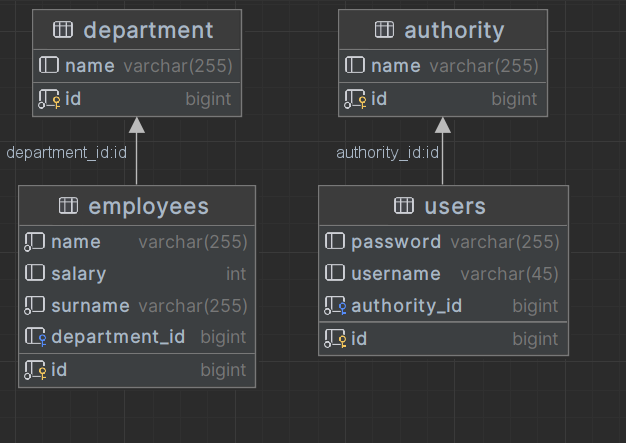

**Employee Management Service README**

# Employee Management Service

The Employee Management Service is a Spring Boot web application that provides functionalities for managing employees and their departments. It utilizes various technologies, including Spring Boot, Hibernate, Spring Data, Basic Auth to offer a robust and secure solution for employee and department management.

## Introduction

The Employee Management Service is designed to simplify the process of managing employees and their departments within an organization. It offers an intuitive web-based interface that allows administrators to perform tasks like adding new employees, updating employee information, managing departments, and assigning employees to specific departments.

## Features

- User Authentication: Secure user authentication using Basic Auth to ensure authorized access to the Service.
- Employee Management: Create, read, update, and delete employee records with support for essential details like name, contact information, and job position.
- Department Management: Manage departments by adding, updating, and deleting department records, along with their associated information.
- User Roles: Differentiate between administrators and regular users with appropriate roles and access permissions.
- Data Persistence: Utilize Hibernate ORM to provide a reliable and efficient data persistence layer.

## Database Schema

